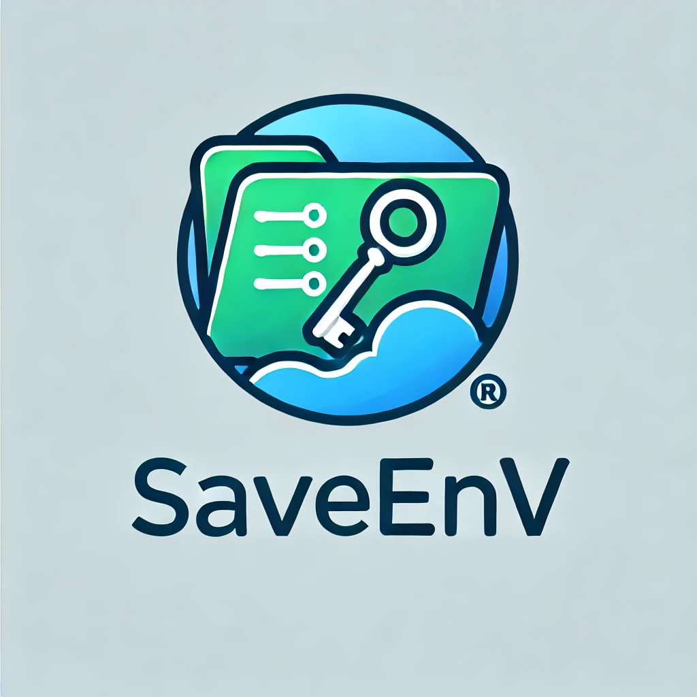

<!-- Improved compatibility of back to top link: See: https://github.com/othneildrew/Best-README-Template/pull/73 -->
<a name="readme-top"></a>

[![Contributors][contributors-shield]][contributors-url]
[![Forks][forks-shield]][forks-url]
[![Stargazers][stars-shield]][stars-url]
[![Issues][issues-shield]][issues-url]
[![MIT][license-shield]][license-url]
[![LinkedIn][linkedin-shield]][linkedin-url]


<!-- PROJECT LOGO -->
<br />
<div align="center">
  <a href="https://github.com/othneildrew/Best-README-Template">
    
  </a>

  <p align="center">
    <br />
    <br />
    <br />
    <a href="https://github.com/cprite/save-env/issues">Report Bug</a>
    ·
    <a href="https://github.com/cprite/save-env/issues">Request Feature</a>
  </p>
</div>


<!-- TABLE OF CONTENTS -->
<details>
  <summary>Table of Contents</summary>
  <ol>
    <li>
      <a href="#about-the-project">About The Project</a>
      <ul>
        <li><a href="#disclaimer">[!] Disclaimer</a></li>
        <li><a href="#built-with">Built With</a></li>
      </ul>
    </li>
    <li>
      <a href="#getting-started">Getting Started</a>
    </li>
    <li><a href="#contributing">Contributing</a></li>
  </ol>
</details>


<!-- ABOUT THE PROJECT -->
## About The Project

In the world of software development, API keys and other sensitive credentials are the keys to accessing critical services and applications. Unfortunately, these keys are sometimes accidentally exposed in public repositories, putting both developers and organizations at risk. If left unprotected, malicious actors can exploit these exposed credentials to access and misuse valuable data, leading to breaches, financial losses, and damaged reputations.

**SaveEnv** was created to address this growing problem by automating the process of detecting and notifying developers about exposed OpenAI API keys in ```.env``` files. By continuously monitoring public GitHub repositories, SaveEnv helps prevent sensitive data from falling into the wrong hands. The project's aim is to provide an easy-to-use tool that alerts developers to their mistakes before they can be exploited.

The script automatically scans GitHub every hour for ```.env``` files that may have OpenAI API keys. Here’s how the process works:

1. The script searches for public repositories with .env files that may contain sensitive data.
2. It identifies OpenAI API keys within these .env files.
3. For each extracted key, the script calls the OpenAI API to verify whether the key is still valid.
4. If the key is valid, the script automatically opens an issue on the affected repository, notifying the developer about the exposed key.


### 🛑 Disclaimer 🛑
This tool is designed to help developers protect their sensitive data. It is not intended for malicious use. By using this script, you agree to use it responsibly and within ethical boundaries. Always respect data privacy and security best practices.

### Built With

* [](https://www.python.org)
* [](https://www.selenium.dev/)
* [](https://jupyterlab.readthedocs.io/en/stable)
* [](https://pandas.pydata.org/)
* [](https://www.google.com/chrome/)
* [](https://code.visualstudio.com/)
* [](https://www.raspberrypi.com/products/raspberry-pi-4-model-b/)

<p align="right">(<a href="#readme-top">back to top</a>)</p>


<!-- CONTRIBUTING -->
## Contributing

I'm open to collaboration and contributions from fellow developers! You can easily adapt the code to work with other APIs beyond OpenAI. Feel free to fork the project and modify it to suit your needs. Together, we can enhance this tool and help more developers safeguard their projects.


<!-- DONATIONS -->
## Donations

If you've found **SaveEnv** helpful and feel inclined to support its creator, your donations would be warmly welcomed. Currently I'm on a active journey of growth and exploration in the world of IT, and any contributions will help fuel new learning experiences, creative projects, and continuous innovation. While there’s no expectation, any support will go towards sustaining my student life and further expanding my knowledge and skills. Thank you for your thoughtfulness!
* [](buymeacoffee.com/cprite)

<p align="right">(<a href="#readme-top">back to top</a>)</p>

<!-- MARKDOWN LINKS & IMAGES -->
<!-- https://www.markdownguide.org/basic-syntax/#reference-style-links -->
[contributors-shield]: https://img.shields.io/github/contributors/cprite/save-env.svg?style=for-the-badge
[contributors-url]: https://github.com/cprite/save-env/graphs/contributors
[forks-shield]: https://img.shields.io/github/forks/cprite/save-env.svg?style=for-the-badge
[forks-url]: https://github.com/cprite/save-env/network/members
[stars-shield]: https://img.shields.io/github/stars/cprite/save-env.svg?style=for-the-badge
[stars-url]: https://github.com/cprite/save-env/stargazers
[issues-shield]: https://img.shields.io/github/issues/cprite/save-env.svg?style=for-the-badge
[issues-url]: https://github.com/cprite/save-env/issues
[license-shield]: https://img.shields.io/github/license/cprite/save-env.svg?style=for-the-badge
[license-url]: https://github.com/cprite/save-env/blob/master/LICENSE.md
[linkedin-shield]: https://img.shields.io/badge/-LinkedIn-black.svg?style=for-the-badge&logo=linkedin&colorB=555
[linkedin-url]: https://linkedin.com/in/niknmirosh
