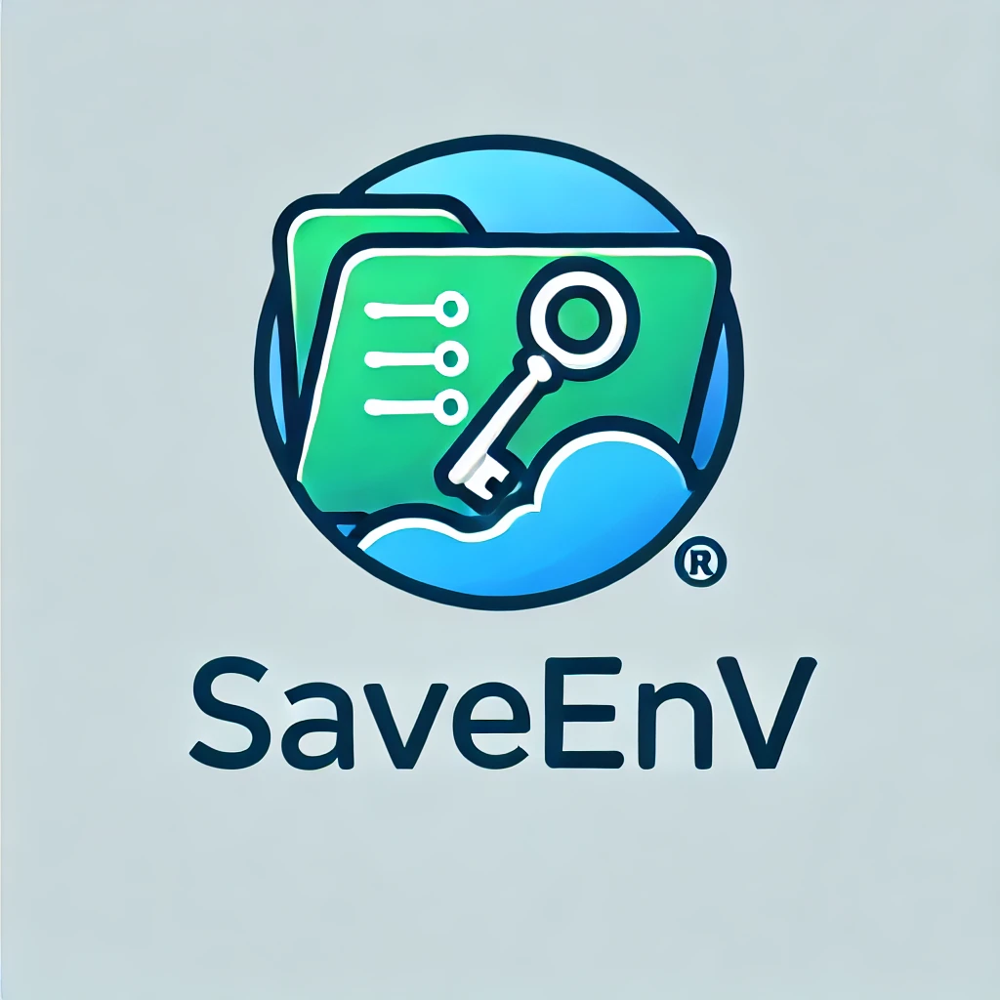

<!-- Improved compatibility of back to top link: See: https://github.com/othneildrew/Best-README-Template/pull/73 -->
<a name="readme-top"></a>

[![Contributors][contributors-shield]][contributors-url]
[![Forks][forks-shield]][forks-url]
[![Stargazers][stars-shield]][stars-url]
[![Issues][issues-shield]][issues-url]
[![MIT][license-shield]][license-url]
[![LinkedIn][linkedin-shield]][linkedin-url]


<!-- PROJECT LOGO -->
<br />
<div align="center">
  <a href="https://github.com/othneildrew/Best-README-Template">
    
  </a>

  <p align="center">
    <br />
    <br />
    <br />
    <a href="https://github.com/cprite/save-env/issues">Report Bug</a>
    ·
    <a href="https://github.com/cprite/save-env/issues">Request Feature</a>
  </p>
</div>


<!-- TABLE OF CONTENTS -->
<details>
  <summary>Table of Contents</summary>
  <ol>
    <li>
      <a href="#about-the-project">About The Project</a>
      <ul>
        <li><a href="#disclaimer">[!] Disclaimer</a></li>
        <li><a href="#built-with">Built With</a></li>
      </ul>
    </li>
    <li>
      <a href="#getting-started">Getting Started</a>
      <ul>
        <li><a href="#installation">Installation</a></li>
        <li><a href="#github-cookies">GitHub Cookies</a></li>
      </ul>
    </li>
    <li><a href="#usage">Usage</a></li>
    <li><a href="#contributing">Contributing</a></li>
  </ol>
</details>


<!-- ABOUT THE PROJECT -->
## About The Project

In the world of software development, API keys and other sensitive credentials are the keys to accessing critical services and applications. Unfortunately, these keys are sometimes accidentally exposed in public repositories, putting both developers and organizations at risk. If left unprotected, malicious actors can exploit these exposed credentials to access and misuse valuable data, leading to breaches, financial losses, and damaged reputations.

**SaveEnv** was created to address this growing problem by automating the process of detecting and notifying developers about exposed OpenAI API keys in ```.env``` files. By monitoring public GitHub repositories, SaveEnv helps prevent sensitive data from falling into the wrong hands. The project's aim is to provide an easy-to-use tool that alerts developers to their mistakes before they can be exploited.

SaveEnv is a **command-line tool**. Here’s how a scan works:

1. It searches public GitHub repositories for `.env` files that may contain OpenAI API keys.
2. It extracts the candidate keys from those files.
3. For each extracted key, it calls the OpenAI API to verify whether the key is still valid.
4. If the key is valid, it opens an issue on the affected repository to notify the developer about the exposed key.

Statistics from each run (keys checked, compromised keys, last scan time) are stored locally and can be printed at any time with `python run.py stats`.


### 🛑 Disclaimer 🛑
This tool is designed to help developers protect their sensitive data. It is not intended for malicious use. By using this script, you agree to use it responsibly and within ethical boundaries. Always respect data privacy and security best practices.

### Built With

* [](https://www.python.org)
* [](https://www.selenium.dev/)
* [](https://www.google.com/chrome/)

<p align="right">(<a href="#readme-top">back to top</a>)</p>


<!-- GETTING STARTED -->
## Getting Started

### Installation

1. Clone the repository:
   ```sh
   git clone https://github.com/cprite/save-env.git
   cd save-env
   ```
2. (Optional) create a virtual environment:
   ```sh
   python -m venv venv
   source venv/bin/activate
   ```
3. Install the dependencies:
   ```sh
   pip install -r requirements.txt
   ```
   Google Chrome must be installed — Selenium drives it in headless mode. The
   matching ChromeDriver is downloaded automatically on first run.

### GitHub Cookies

GitHub code search requires an authenticated session. Copy the example file and
fill in the cookies from a logged-in GitHub session in your browser
(DevTools → Application → Cookies):

```sh
cp app/crawler/data/cookies.example.py app/crawler/data/cookies.py
```

`cookies.py` is git-ignored — never commit your real session cookies.

<p align="right">(<a href="#readme-top">back to top</a>)</p>


<!-- USAGE -->
## Usage

Run a single scan and print the results:

```sh
python run.py scan
```

Keep scanning on a schedule (e.g. every hour) until interrupted with `Ctrl+C`:

```sh
python run.py scan --interval 3600
```

Print the statistics from the last scan without scanning again:

```sh
python run.py stats
```

Add `-v` / `--verbose` to any command for debug logging:

```sh
python run.py -v scan
```

Full help:

```sh
python run.py --help
python run.py scan --help
```

<p align="right">(<a href="#readme-top">back to top</a>)</p>


<!-- CONTRIBUTING -->
## Contributing

I'm open to collaboration and contributions from fellow developers! You can easily adapt the code to work with other APIs beyond OpenAI. Feel free to fork the project and modify it to suit your needs. Together, we can enhance this tool and help more developers safeguard their projects.


<p align="right">(<a href="#readme-top">back to top</a>)</p>

<!-- MARKDOWN LINKS & IMAGES -->
<!-- https://www.markdownguide.org/basic-syntax/#reference-style-links -->
[contributors-shield]: https://img.shields.io/github/contributors/cprite/save-env.svg?style=for-the-badge
[contributors-url]: https://github.com/cprite/save-env/graphs/contributors
[forks-shield]: https://img.shields.io/github/forks/cprite/save-env.svg?style=for-the-badge
[forks-url]: https://github.com/cprite/save-env/network/members
[stars-shield]: https://img.shields.io/github/stars/cprite/save-env.svg?style=for-the-badge
[stars-url]: https://github.com/cprite/save-env/stargazers
[issues-shield]: https://img.shields.io/github/issues/cprite/save-env.svg?style=for-the-badge
[issues-url]: https://github.com/cprite/save-env/issues
[license-shield]: https://img.shields.io/github/license/cprite/save-env.svg?style=for-the-badge
[license-url]: https://github.com/cprite/save-env/blob/master/LICENSE
[linkedin-shield]: https://img.shields.io/badge/-LinkedIn-black.svg?style=for-the-badge&logo=linkedin&colorB=555
[linkedin-url]: https://linkedin.com/in/niknmirosh
